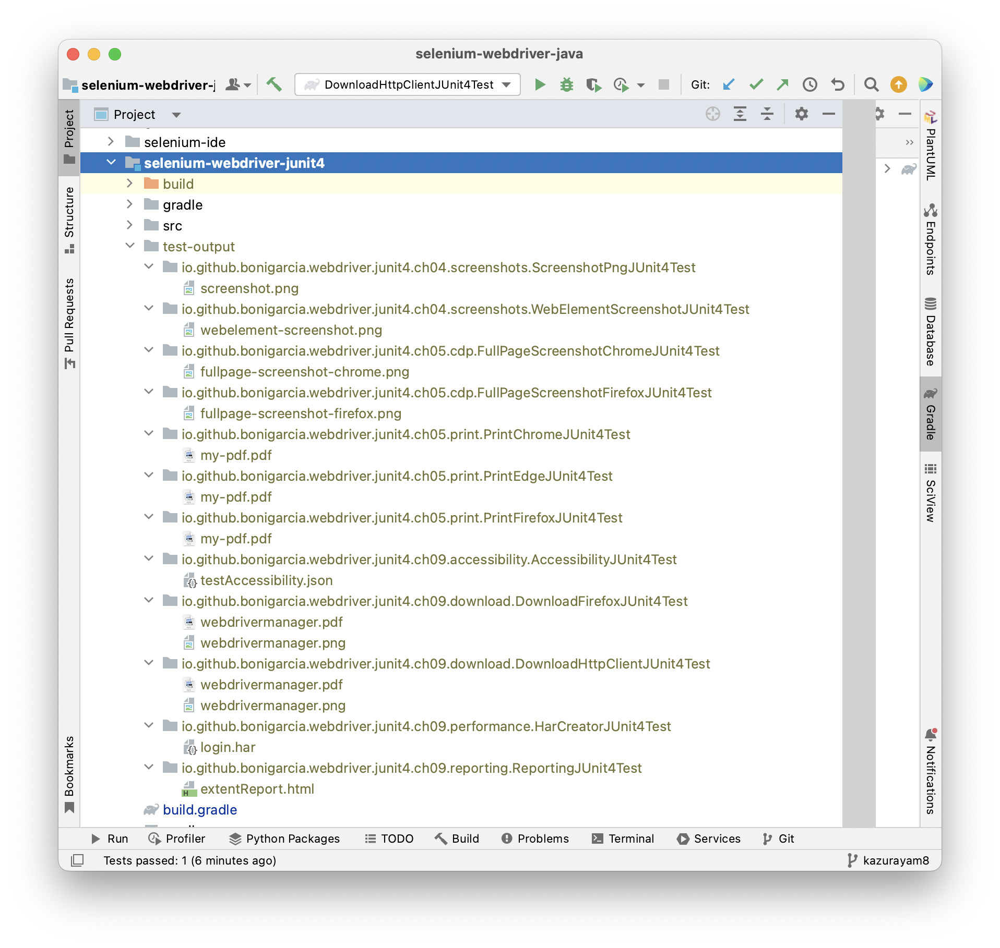

- Table of contents
{:toc}

# Unittest Helper

-   author: kazurayam

-   version: 0.4.0

-   source project: <https://github.com/kazurayam/unittest-helper>

-   javadoc: <https://kazurayam.github.io/unittest-helper/api>

-   distributed at: <https://mvnrepository.com/artifact/com.kazurayam/unittest-helper>

## Problems to solve

Let me explain a problem with a sample code.

I cloned the [unittest-helper](https://github.com/kazurayam/unittest-helper) project onto my Mac machine.

Please note that this project is a [Gradle Multi-Project](https://docs.gradle.org/current/userguide/intro_multi_project_builds.html), where the root directory `unittest-helper` contains a few sub-directories `lib`, `app` and `preliminary-study`. Each of these 3 directories contain `build.gradle` file. Gradle "Multi-Project" is just a usual style of project structure nowadays. It is nothing exceptional.

Please find <https://github.com/kazurayam/unittest-helper/preliminary-study/src/test/java/study/S2WritingSystemPropertyValueIntoFileInTheOutputDirectoryTest.java>:

    package study;

    import org.testng.annotations.Test;

    import java.io.IOException;
    import java.nio.file.Files;
    import java.nio.file.Path;
    import java.nio.file.Paths;
    import java.util.Optional;

    public class S2WritingSystemPropertyValueIntoFileInTheOutputDirectoryTest {

        @Test
        public void testIt() throws IOException {
            // receive a System property
            Optional<String> text =
                    Optional.ofNullable(System.getProperty("browserType"));
            System.out.println("System.property(\"browserType\")=" + text.orElse("null"));
            // write the "browserType" value into a file
            // in the "test-output" directory under the "user.dir"
            Path currentWorkingDirectory = Paths.get(System.getProperty("user.dir"));
            Path outputDir = currentWorkingDirectory.resolve("test-output");
            Path file = outputDir.resolve("browserType.txt");
            System.out.println("file path=" + TestUtils.shortenPath(file));
            if (text.isPresent()) {
                Files.createDirectories(file.getParent());
                Files.write(file, text.get().getBytes());
                System.out.println("file content=" +
                        String.join("", Files.readAllLines(file)));
            }
        }
    }

1.  This code is a unit-test class in Java.

2.  This test reads a Java System Property named `browserType` specified in the commandline option

3.  This test creates a directory named `test-output`. The `test-output` directory will be located under the so-called Current Working Directory, which is identified by the System Property `user.dir`.

4.  This test writes the value of System Property `browserType` into a file named `browserType.txt` which is located in the `test-output` directory.

You can find how the task `testS2` is defined in the <https://github.com/kazurayam/unittest-helper/preliminary-study/build.gradle>

    tasks.register("testS2", Test) {
        useTestNG()                                  // (1)
        include "**/S2*"                             // (2)
        systemProperties System.properties           // (3)
        testLogging { showStandardStreams = true }   // (4)
        outputs.upToDateWhen { false }               // (5)
    }

1\) I declared that I want to use NestNG to run my test cases in the `testS2` task.
2) I specifically chose a class of which className starts with `S2`.
3) I passed all of System.properties into the `testS2` task
4) I specified to show all of messages from the test classes to stdout to be printed in the console
5) I specified Gradle to run the `testS2` task even if there is no change in the input.

I opened the Terminal app, and ran the following commands.

## Case1: with the subproject’s directory as Current Working Directory

    $ cd ~/github/unittest-helper
    $ cd preliminary-study
    $ pwd
    /Users/kazurayam/github/unittest-helper/preliminary-study
    $ gradle testS2 -DbrowserType=Chrome

    > Task :preliminary-study:testS2

    Gradle suite > Gradle test > study.S2WritingSystemPropertyValueIntoFileInTheOutputDirectoryTest > testIt STANDARD_OUT
        System.property("browserType")=Chrome
        file path=~/github/unittest-helper/preliminary-study/test-output/browserType.txt
        file content=Chrome

    BUILD SUCCESSFUL in 2s
    2 actionable tasks: 1 executed, 1 up-to-date

Please note that the output directory `test-output` was located in the **subproject’s directory** `unittest-helper/preliminary-study/`.

## Case2: with the root project’s directory as Current Working Directory

Gradle allows us another way of invoking the same task `testS2`, as follows:

    $ pwd
    /Users/kazuakiurayama/github/unittest-helper
    :~/github/unittest-helper (issue36 *)
    $ gradle :preliminary-study:testS2 -DbrowserType=FireFox

    > Task :preliminary-study:testS2

    Gradle suite > Gradle test > study.S2WritingSystemPropertyValueIntoFileInTheOutputDirectoryTest > testIt STANDARD_OUT
        System.property("browserType")=FireFox
        file path=~/github/unittest-helper/test-output/browserType.txt
        file content=FireFox

    BUILD SUCCESSFUL in 3s
    2 actionable tasks: 1 executed, 1 up-to-date

Please note that the output directory `test-output` was located in the **root project’s directory** `unittest-helper/`.

## Problem: Current Working Directory is not necessarily equal to the subproject’s directory

I want my test class `study.S2WritingSystemPropertyValueIntoFileInTheOutputDireoctyTest` to create the directory `test-output` always under the subproject’s directory. In the Case1, I got `unittest-helper/preliminary-study/test-output`, with which I am OK. However, in the Case2, I got `unittest-helper/test-output`. I am not happy with the result.

<figure>

</figure>

The source code of the test class `study.S2WritingSystemPropertyValueIntoFileInTheOutputDirectoryTest` was unchanged. But the result changed because I ran the test in the commandline a bit differently. In the Case1, I changed to the directory `unittest-helper/preliminary-study`, and in the Case2, I changed to the directory `unittest-helper`. And the important factor was that the `testS2` task had a line:

    tasks.register("testS2", Test) {
        ...
        systemPropert System.properties
        ...
    }

By this single line, Gradle captured all the values of System.properties at the timing when I invoked `gradle` command and the values were imported into the runtime environment where the test class `S2WrintingSystemPropertyValueIntoFileInTheOutputDirecvtoryTest` ran. In the Case1, the System Property `user.dir` had the value of `` …​/unittest-helpers/preliminary-study; and in the Case2, the `user.dir `` had the value of `…​/unittest-helper`. Therefore the directory `test-output` was located at the different layer of project structure.

## What I want

I want the `test-output` directory to be always under the subproject’s directory regardless at which directory the System property `user.dir` is set at runtime. **I should NOT rely on the `user.dir` to find out where the subproject directory is.**

## But how?

There is a narrow path for every test classes to find out where the project’s directory is without referring to the System property `user.dir`. I will show you a sample code how to.

Please find <https://github.com/kazurayam/unittest-helper/preliminary-study/src/test/java/study/S3FindingProjectDirByClasspathTest.java>:

    package study;

    import org.testng.annotations.Test;

    import java.net.URL;
    import java.security.CodeSource;
    import java.security.ProtectionDomain;

    import static org.assertj.core.api.Assertions.assertThat;

    public class S3FindingProjectDirByClasspathTest {

        @Test
        public void getLocationWhereThisClassIsFound() {
            ProtectionDomain pd = this.getClass().getProtectionDomain();
            CodeSource codeSource = pd.getCodeSource();
            URL url = codeSource.getLocation();
            System.out.println("codeSource url=" + url.toString());
            // e.g, "url=file:/Users/kazurayam/github/unittest-helper/preliminary-study/build/classes/java/test/"
            assertThat(url.toString()).contains("unittest-helper/preliminary-study/build/classes/java/test");
            String codeSourcePathElementsUnderProjectDirectory = "build/classes/java/test/";
            String projectDir =
                    url.toString().replace(codeSourcePathElementsUnderProjectDirectory,"");
            System.out.println("project directory=" + TestUtils.shortenPath(projectDir));
        }
    }

You can run this test by `testS3` task defined in the `unittest-helper/preliminary-study/build.gradle`.

I ran it, as follows:

    $ pwd
    /Users/kazuakiurayama/github/unittest-helper/preliminary-study

    $ gradle testS3

    > Task :preliminary-study:testS3

    Gradle suite > Gradle test > study.S3FindingProjectDirByClasspathTest > getLocationWhereThisClassIsFound STANDARD_OUT
        codeSource url=file:/Users/kazuakiurayama/github/unittest-helper/preliminary-study/build/classes/java/test/
        project directory=file:/Users/kazuakiurayama/github/unittest-helper/preliminary-study/

    BUILD SUCCESSFUL in 2s
    2 actionable tasks: 1 executed, 1 up-to-date

And also I ran the same task at a different directory

    $ pwd
    /Users/kazuakiurayama/github/unittest-helper

    $ gradle :preliminary-study:testS3

    > Task :preliminary-study:testS3

    Gradle suite > Gradle test > study.S3FindingProjectDirByClasspathTest > getLocationWhereThisClassIsFound STANDARD_OUT
        codeSource url=file:/Users/kazuakiurayama/github/unittest-helper/preliminary-study/build/classes/java/test/
        project directory=file:/Users/kazuakiurayama/github/unittest-helper/preliminary-study/

    BUILD SUCCESSFUL in 2s
    2 actionable tasks: 1 executed, 1 up-to-date

Please note that in both trial, the test class printed the path string as the project directory:

        project directory=file:/Users/kazuakiurayama/github/unittest-helper/preliminary-study/

This is what I want to achieve. The test class `S3FindingProjectDirByClasspathTest` proved that it can find where the subproject’s directory is without refering to the System property `user.dir`. Please read the source of `getLocationWhereThisClassIsFound()` method to find out the coding technique.

## A difficulty to overcome

Read the source of `getLocationWhereThisClassIsFound` method of [S3FindingProjectDirByClasspathTest](https://github.com/kazurayam/unittest-helper/preliminary-study/src/test/java/study/S3FindingProjectDirByClasspathTest.java). You would notice a technical issue to overcome. The method has a fragment:

            String codeSourcePathElementsUnderProjectDirectory = "build/classes/java/test/";
            String projectDir =
                    url.toString().replace(codeSourcePathElementsUnderProjectDirectory,"");

Here you find a string literal `build/classes/java/test/` which is a valid path elements under the project directory only in a Gradle Java project. Different string literals would be required for other Languages (Groovy, Kotlin), for other Build Tools (Gradle, Maven, Ant), for other IDEs (IDEA, Eclipse, NetBeans, etc). This possible variation makes thinks difficult to manage.

## Problems to solve

### Is Current Working Directory reliable for unit-tests? --- Not always

Sometimes, I want my JUnit-based tests in Java to write a file. Where to locate the file? The simplest idea would be to write the file immediately under the project directory. Let me show you an example.

-   I have a Gradle Multi-project <https://github.com/kazurayam/unittest-helper>

-   In this parent project, I have a Gradle sub-project [`:app`](https://github.com/kazurayam/unittest-helper/tree/develop/app).

-   In this sub-project, I have a JUnit5-based test class [`com.kazurayam.unittesthelperdemo.OutputIntoCurrentWorkingDirectoryTest`](https://github.com/kazurayam/unittest-helper/blob/develop/app/src/test/java/com/kazurayam/unittesthelperdemo/OutputIntoCurrentWorkingDirectoryTest.java)

-   If you have a look at the source, you would find that this test calls `java.nio.file.Paths.get(String fileName)`, will locate a file `sample1.txt` in the **current working directory** runtime, as follows:

<!-- -->

        public void test_write_under_current_working_directory() throws Exception {
            Path p = Paths.get("sample1.txt");
            Files.write(p, "Hello, world!".getBytes(StandardCharsets.UTF_8));
            System.out.println("[test_write_under_current_working_directory] p = " + p.toAbsolutePath());
        }

-   When I run this test, I will get the file in the sub-project’s directory, as follows

<!-- -->

    $ pwd
    ~/github/unittest-helper
    :~/github/unittest-helper (develop *)
    $ tree -L 1 app
    app
    ├── build
    ├── build.gradle
    ├── sample1.txt
    └── src

    3 directories, 2 files

The `sample1.txt` file was written into the **current working directory**, which is the sub-project’s directory. OK. This is what I expected.

Now, I would show you another sample code. It will show you a call to `Paths.get(String fileName)` does not necessarily write a file into the project directory. Have a look at a sub-project [`selenium-webdriver-junit5`](https://github.com/kazurayam/unittest-helper/tree/develop/selenium-webdriver-junit5).

> The `selenium-webdriver-junit` project is quoted from the sample code of the book [
> Boni García, "Hands-On Selenium WebDriver with Java"](https://github.com/bonigarcia/selenium-webdriver-java)

It contains:

-   [selenium-webdriver-junit5/build.gradle](https://github.com/kazurayam/unittest-helper/blob/develop/selenium-webdriver-junit5/build.gradle)

-   [ScreenshotPngJupiterTest.java](https://github.com/kazurayam/unittest-helper/blob/develop/selenium-webdriver-junit5/src/test/java/io/github/bonigarcia/webdriver/jupiter/screenshots/ScreenshotPngJupiterTest.java)

The test class has a line:

            Path destination = Paths.get("screenshot.png");

So I expect that the `ScreeshotPngJupiterTest.java` will write a file immediately under the sub-project directory. However, in fact when I ran the test, I was surprised to find the file `screenshot.png` was written into the parent project directory, not into the sub-project directory.

    $ pwd
    ~/github/unittest-helper

    $ gradle :selenium-webdriver-junit5:test
    ...(a few minutes passed)

    $ tree -L 2 .
    .
    ...
    ├── build.gradle
    ...
    ├── screenshot.png           <===
    ├── selenium-webdriver-junit5
    │   ├── README.md
    │   ├── build
    │   ├── build.gradle
    │   └── src
    └── settings.gradle

    16 directories, 29 files

Why the `screenshot.png` file was written into the parent project `unittest-helper` directory? Why not the file was written into the sub-project `selenium-webdriver-junit5` directory? This is the original problem I got.

I studied the codes and found the cause of the issue. In the `selenium-webdriver-junit5/build.gradle` I found a line:

    test {
        ...
        systemProperty System.properties
    }

With this single line, the problem occurred. When I ran a command `gradle :selenium-webdriver-junit5:test` in the command line, the `System.properites` contained the `System.getProperty("user.dir")` with the value equals to the parent project’s directory, which was passed to the test classes invoked. Consequently in the test class, a call to `java.nio.file.Paths.get(String fileName)` found the `System.getProperty("user.dir")` has the path of the parent project directory, not the sub-project directory.

Consequently I learned that I should not use `java.nio.file.Paths.get(String fileName)` in the test classes at all because it does not necessarily return the path of project directory.

But how to locate the output files from tests without `Paths.get(String)`? The following post in the Gradle forum gave me a clue:

-   [Gradle Forums, How do I set the working dreictory for TestNG in a multi-project Gradle build?](https://discuss.gradle.org/t/how-do-i-set-the-working-directory-for-testng-in-a-multi-project-gradle-build/7379/7)

> luke\_daley
> Gradle Employee
> Nov '13
>
> Loading from the filesystem using relative paths during unit tests is problematic because different environments will set a different working directory for the test process. For example, Gradle uses the projects directory while IntelliJ uses the directory of the root project.
>
> The only really safe way to solve this problem is to load via the classpath. Is this a possibility for your scenario?

OK, I would try that.

### Organizing output files from tests; it requires efforts

The easiest way to locate an output file from a unit-test is to call `java.io.File("some-file.txt")` or `java.nio.Paths("some-file.txt")`. Then the `some-file.txt` will be located under the current working directory = `System.getProperty("user.dir")`. Using Maven and Gradle, the current working directory will usually be equal to the project’s directory. However, you should be careful. If you are dependent on calling `java.io.File(relative path)` too often, you will get a lot of temporary files located in the project directory, like this.

    .
    ├── 2023.10.24_22.07.27.742-7440524241d0dbd63ca5eec377b6455c.png    --- x
    ├── 2023.10.24_22.07.29.333-7440524241d0dbd63ca5eec377b6455c.png    --- x
    ├── build
    │   ├── allure-results
    │   ├── classes
    │   ├── downloads
    │   ├── generated
    │   ├── reports
    │   ├── resources
    │   ├── test-results
    │   └── tmp
    ├── build.gradle
    ├── extentReport.html    --- x
    ├── fullpage-screenshot-chrome.png    --- x
    ├── gradle
    │   └── wrapper
    ├── gradlew
    ├── gradlew.bat
    ├── login.har    --- x
    ├── my-pdf.pdf    --- x
    ├── pom.xml
    ├── screenshot.png    --- x
    ├── src
    │   ├── main
    │   └── test
    ├── target
    │   ├── classes
    │   ├── generated-sources
    │   ├── generated-test-sources
    │   ├── maven-status
    │   └── test-classes
    ├── testAccessibility.json    --- x
    ├── webdrivermanager.pdf    --- x
    ├── webdrivermanager.png    --- x
    └── webelement-screenshot.png    --- x

    20 directories, 15 files

Here the files labeled with "--- x" are the temporary output files created by the unit-tests.

Temporary files located in the project directory make the project tree dirty. The files scattered in the project directory are difficult to manage. If you want to remove them, you have to choose each files and delete them one by one manually.

Rather, I want to create a dedicated directory where all test classes should write their output into. I would list it in the `.gitignore` file to exclude the temporary files out of the git repository.

## Solution

This project provides a Java class [`com.kazurayam.unittest.TestOutputOrganizer`](https://github.com/kazurayam/unittest-helper/blob/develop/lib/src/main/java/com/kazurayam/unittest/TestOutputOrganizer.java).

The `TestOutputOrganizer` helps your unit tests to save files into a dedicated directory in the Maven/Gradle project. Using this class, you can easily prepare a directory into which your unit tests can write files. The location of the output directory is resolved via the classpath of the unit-test class. The `TestOutputOrganizer` does ot depend on the value returned by `System.getProperty("user.dir")`.

The `TestOutputOrgainzer` class is independent on the type of unit-testing frameworks you choose: JUnit4, JUnit5 and TestNG.

The `TestOutputOrgainzer` class is compiled by Java8.

Using the `TestOutputOrganizer` class, you can well-organize the files created by test classes, as follows:

<figure>

</figure>

## How does the `TestOutputOrganizer` resolves the project root directory ?

The `getProject()` method of `TestOutputOrganizer` class internally works as follows.

1.  The constructor call `new TestOutputOrganizer.Builder(this.getClass())` tells it should look at the code source of `this` object, which is `/Users/kazurayam/github/unittest-helper/app/build/classes/java/test/com/kazurayam/unittestshelperdemo/OrganizerPresentTest.class`.

2.  The `TestOutputOrganizer` internally tries to find out which build tool you used: Maven or Gradle?
    If you used Maven, it expects that the project directory to have a subdirectory `target/test-classes`. If the `TestOutputOrganizer` found `target/test-classes` in the code source path, then the parent directory of the `target` directory is presumed to be the project directory.
    If you use Gradle, the `TestOutputOrganizer` expects that the project directory would have a subdirectory `build/classes/java/test`. So `TestOutputOrganizer` tries to find `build/classes/java/test` in the code source path. When the subdirectory pattern is found in the code source path, then the parent directory of the `build` directory is presumed to be the project dir.

The `com.kazurayam.unittest.ProjectDirectoryResovler` class has a list of the patterns to match against the code source given. You can che check the content of the list. Let me assume you have the following test code:

    package com.kazurayam.unittesthelperdemo;

    import com.kazurayam.unittest.CodeSourcePathElementsUnderProjectDirectory;
    import com.kazurayam.unittest.ProjectDirectoryResolver;
    import org.junit.jupiter.api.Test;
    import org.slf4j.Logger;
    import org.slf4j.LoggerFactory;

    import java.nio.file.Path;
    import java.util.List;

    import static org.assertj.core.api.Assertions.assertThat;

    public final class ProjectDirectoryResolverTest {

        Logger log = LoggerFactory.getLogger(ProjectDirectoryResolverTest.class);

        @Test
        public void test_getProjectDirViaClasspath() {
            ProjectDirectoryResolver resolver = new ProjectDirectoryResolver();
            Path projectDir = resolver.resolveProjectDirectoryViaClasspath(ProjectDirectoryResolverTest.class);
            log.info("projectDir: " + projectDir);
        }

        @Test
        public void test_getRegisteredListOfCodeSourcePathElementsUnderProjectDirectory() {
            List<CodeSourcePathElementsUnderProjectDirectory> listOfCSPE =
                    new ProjectDirectoryResolver().getRegisteredListOfCodeSourcePathElementsUnderProjectDirectory();
            assertThat(listOfCSPE).isNotNull();
            assertThat(listOfCSPE.size()).isGreaterThanOrEqualTo(2);
            for (CodeSourcePathElementsUnderProjectDirectory cspe : listOfCSPE) {
                log.info("CodeSourcePathElementsUnderProjectDirectory: " + cspe);
            }
        }
    }

This test prints the following result in the console:

    sublistPattern : [target, test-classes]
    sublistPattern : [build, classes, java, test]
    sublistPattern : [build, classes, java, functionalTest]
    sublistPattern : [build, classes, groovy, test]
    sublistPattern : [build, classes, groovy, functionalTest]
    sublistPattern : [build, classes, kotlin, test]
    sublistPattern : [build, classes, kotlin, functionalTest]

The 1st sublistPattern is for Maven. the 2nd, sublistPattern is for Java codes built in Gradle.

Do you need a unique sublistPattern other than those built-in ones?

OK. You can add more sublistPatterns for your own needs by calling the `TestOutputOrganizer.Builder.sublistPattern(List<String>)` method.

## Examples

# === Example1 Locating a file path via Current Working Directory

    package com.kazurayam.unittesthelperdemo;

    import org.junit.jupiter.api.Test;

    import java.nio.charset.StandardCharsets;
    import java.nio.file.Files;
    import java.nio.file.Path;
    import java.nio.file.Paths;
    import org.slf4j.LoggerFactory;
    import org.slf4j.Logger;

    public class OutputIntoCurrentWorkingDirectoryTest {

        Logger log = LoggerFactory.getLogger(OutputIntoCurrentWorkingDirectoryTest.class);

        @Test
        public void test_show_CWD() {
            Path p = Paths.get(".");
            log.info("[test_show_CWD] " + p.toAbsolutePath().normalize());
        }

        /*
         * will create a file `<projectDir>/sample1.txt`
         */
        @Test
        public void test_write_under_current_working_directory() throws Exception {
            Path p = Paths.get("sample1.txt");
            Files.write(p, "Hello, world!".getBytes(StandardCharsets.UTF_8));
            System.out.println("[test_write_under_current_working_directory] p = " + p.toAbsolutePath());
        }

    }

[source](https://github.com/kazurayam/unittest-helper/blob/develop/app/src/test/java/com/kazurayam/unittesthelperdemo/OutputIntoCurrentWorkingDirectoryTest.java)

This code calls `Paths.get("sample1_txt")` to resolve the path of output file. Many developers would do the same in their own codes. This code prints the following message:

    > Task :app:testClasses
    [test_write_under_current_working_directory] p = ~/github/unittest-helper/app/sample1.txt

The call to `Paths.get("sample1.txt")` regards the parameter `sample1.txt` as relative to the runtime **Current Working Directory**. In the above case, the current working directory WILL be set `~/github/unittest-helper/app/`. And the path is equal to the project directory. So the `Paths.get("sample1.txt")` will return a Path object of `~/github.unittest-helper/app/sample1.txt`.

Is the **current working directory** equal to the **project directory** ? --- Usually yes. But sometimes not. It depends on the runtime environment. When the current working directory is different from the project directory, we will be really confused.

So I do not like my unit-tests to depend on the current working directory. But any other way?

## Example2 Resolving the project directory resolved via classpath

I want my tests to be able to resolve the path of the project directory so that my tests can locate temporary output files surely under the project directory. And I want my tests to be independent from the **current working directory**. I want to find out the project directory’s path value based on the path value of the class file of the test itself. The following code shows it is possible.

    package com.kazurayam.unittesthelperdemo;

    import com.kazurayam.unittest.CodeSourcePathElementsUnderProjectDirectory;
    import com.kazurayam.unittest.ProjectDirectoryResolver;
    import org.junit.jupiter.api.Test;
    import org.slf4j.Logger;
    import org.slf4j.LoggerFactory;

    import java.nio.file.Path;
    import java.util.List;

    import static org.assertj.core.api.Assertions.assertThat;

    public final class ProjectDirectoryResolverTest {

        Logger log = LoggerFactory.getLogger(ProjectDirectoryResolverTest.class);

        @Test
        public void test_getProjectDirViaClasspath() {
            ProjectDirectoryResolver resolver = new ProjectDirectoryResolver();
            Path projectDir = resolver.resolveProjectDirectoryViaClasspath(ProjectDirectoryResolverTest.class);
            log.info("projectDir: " + projectDir);
        }

[source](https://github.com/kazurayam/unittest-helper/blob/develop/app/src/test/java/com/kazurayam/unittesthelperdemo/ProjectDirectoryResolverTest.java)

This will print the following in the console:

    projectDir: /Users/kazurayam/github/unittest-helper/app

How the `com.kazurayam.unittest.ProjectDirectoryResolver` class find the path of project directory via classpath? --- I will describe the detail later. For now, let me talk about how to utilize this library.

## Example3 Locating the default output directory

I want to create a directory named `test-output` under the project directory. I would let my test classes to write files into the directory. I want to for output files `test-output` directory by calling `getOutputDir()`.

    package com.kazurayam.unittesthelperdemo;

    import com.kazurayam.unittest.TestOutputOrganizer;
    import org.junit.jupiter.api.Test;
    import org.slf4j.Logger;
    import org.slf4j.LoggerFactory;

    import java.io.IOException;
    import java.nio.file.Path;

    public class Ex03Test {

        Logger log = LoggerFactory.getLogger(Ex03Test.class);

        @Test
        public void test_getOutputDir_as_default() throws IOException {
            TestOutputOrganizer too = new TestOutputOrganizer.Builder(this.getClass()).build();
            Path outputDir = too.createOutputDirectory();
            log.info("[test_getOutputDir_as_default] " + outputDir);
            log.info("[test_getOutputDir_as_default] " +
                    too.toHomeRelativeString(outputDir));
        }

    }

[source](https://github.com/kazurayam/unittest-helper/blob/develop/app/src/test/java/com/kazurayam/unittesthelperdemo/Ex03Test.java)

This will print the following in the console:

    [test_getOutputDir_as_default] /Users/kazurayam/github/unittest-helper/app/test-output
    [test_getOutputDir_as_default] ~/github/unittest-helper/app/test-output

The default name of the **output directory** is `test-output`. You can explicitly set the name of of the output directory. I will explain it later.

With `toHomeRelativePath(Path p)` method, you can convert a full path string into a path string realtive to the Home directory of the OS user. This is useful for documentation purposes.

## Example4 Creating a custom output directory

The `com.kazurayam.unittest.TestOutputOrganizer` creates a directory with `getOutputDirectory()` and the default name is `test-output`. You may want some other name. Of course you can do it.

    package com.kazurayam.unittesthelperdemo;

    import com.kazurayam.unittest.TestOutputOrganizer;
    import org.junit.jupiter.api.Test;
    import org.slf4j.Logger;
    import org.slf4j.LoggerFactory;

    import java.io.IOException;
    import java.nio.file.Path;

    public class Ex04Test {

        Logger log = LoggerFactory.getLogger(Ex04Test.class);

        @Test
        public void test_getOutputDir_custom() throws IOException {
            TestOutputOrganizer too =
                    new TestOutputOrganizer.Builder(this.getClass())
                            .outputDirectoryPathRelativeToProject("test-output-another")
                            .build();
            Path outputDir = too.createOutputDirectory();
            log.info("[test_getOutputDir_custom] " +
                    too.toHomeRelativeString(outputDir));
        }

        @Test
        public void test_getOutputDir_custom_more() throws IOException {
            TestOutputOrganizer too = new TestOutputOrganizer.Builder(this.getClass())
                    .outputDirectoryPathRelativeToProject("build/tmp/testOutput")
                    .build();
            Path outputDir = too.createOutputDirectory();
            log.info("[test_getOutputDir_custom_more] " +
                    too.toHomeRelativeString(outputDir));
        }
    }

[source](https://github.com/kazurayam/unittest-helper/blob/develop/app/src/test/java/com/kazurayam/unittesthelperdemo/Ex04Test.java)

This will print the following in the console:

    [test_getOutputDir_custom] ~/github/unittest-helper/app/test-output-another
    [test_getOutputDir_custom_more] ~/github/unittest-helper/app/build/tmp/testOutput

## Example5 Writing a file into the default output directory

    package com.kazurayam.unittesthelperdemo;

    import com.kazurayam.unittest.TestOutputOrganizer;
    import org.junit.jupiter.api.Test;
    import org.slf4j.Logger;
    import org.slf4j.LoggerFactory;

    import java.nio.charset.StandardCharsets;
    import java.nio.file.Files;
    import java.nio.file.Path;
    import java.util.List;

    public class Ex05Test {

        Logger log = LoggerFactory.getLogger(Ex05Test.class);

        @Test
        public void test_write_a_file_into_the_default_output_directory() throws Exception {
            TestOutputOrganizer too = new TestOutputOrganizer.Builder(this.getClass()).build();
            Path file = too.createOutputDirectory().resolve("sample.txt");
            Files.write(file, "Hello, world!".getBytes(StandardCharsets.UTF_8));
            log.info("[test_write_a_file_into_the_default_output_directory] " +
                    too.toHomeRelativeString(file));
            List<String> content = Files.readAllLines(file);
            log.info(content.toString());
        }
    }

[source](https://github.com/kazurayam/unittest-helper/blob/develop/app/src/test/java/com/kazurayam/unittesthelperdemo/Ex05.java)

This will print the following in the console:

    [test_write_into_the_default_output_directory] ~/github/unittest-helper/app/test-output/sample.txt
    [Hello, world!]

## Example6 Writing a file into a subdirectory under the default output directory

    package com.kazurayam.unittesthelperdemo;

    import com.kazurayam.unittest.TestOutputOrganizer;
    import org.junit.jupiter.api.Test;
    import org.slf4j.Logger;
    import org.slf4j.LoggerFactory;

    import java.nio.charset.StandardCharsets;
    import java.nio.file.Files;
    import java.nio.file.Path;
    import java.util.List;

    public class Ex06Test {

        Logger log = LoggerFactory.getLogger(Ex06Test.class);

        @Test
        public void test_write_into_subdir_under_the_default_output_directory() throws Exception {
            TestOutputOrganizer too = new TestOutputOrganizer.Builder(this.getClass()).build();
            Path file = too.createOutputDirectory().resolve("sub/sample.txt");
            // you need to make sure that the parent directory exists
            Files.createDirectories(file.getParent());

            Files.write(file, "Hello, world!".getBytes(StandardCharsets.UTF_8));
            log.info("[test_write_into_subdir_under_the_default_output_directory] " +
                    too.toHomeRelativeString(file));
            List<String> content = Files.readAllLines(file);
            log.info(content.toString());
        }

    }

[source](https://github.com/kazurayam/unittest-helper/blob/develop/app/src/test/java/com/kazurayam/unittesthelperdemo/Ex06Test.java)

This will print the following in the console:

    [test_write_into_subdir_under_the_default_output_directory] p = ~/github/unittest-helper/app/test-output/sub/sample.txt

You can create layers of sub-directories under the output directory managed by the `TestOutputOrganizer`. But you are responsible to make sure the parent directory of a file is present. So the following statement was necessary:

            Path file = too.getOutputDirectory().resolve("sub/sample.txt");
            // you need to make sure that the parent directory exists
            Files.createDirectories(file.getParent());

## Example7 Writing a file into a custom output directory

    package com.kazurayam.unittesthelperdemo;

    import com.kazurayam.unittest.TestOutputOrganizer;
    import org.junit.jupiter.api.Test;
    import org.slf4j.Logger;
    import org.slf4j.LoggerFactory;

    import java.nio.charset.StandardCharsets;
    import java.nio.file.Files;
    import java.nio.file.Path;
    import java.util.List;

    import static org.assertj.core.api.AssertionsForClassTypes.assertThat;

    public class Ex07Test {

        Logger log = LoggerFactory.getLogger(Ex07Test.class);

        @Test
        public void test_write_into_subdir_under_the_custom_output_directory() throws Exception {
            TestOutputOrganizer too =
                    new TestOutputOrganizer.Builder(this.getClass())
                            .outputDirectoryPathRelativeToProject("build/tmp/testOutput").build();
            Path file = too.createOutputDirectory().resolve("sample.txt");
            // you do not have to make sure that the parent directory exists
            // Files.createDirectories(file.getParent());

            Files.write(file, "Hello, world!".getBytes(StandardCharsets.UTF_8));
            log.info("[test_write_into_subdir_under_the_custom_output_directory] " +
                    too.toHomeRelativeString(file));
            List<String> content = Files.readAllLines(file);
            log.info(content.toString());

            assertThat(too.createOutputDirectory().getFileName().toString()).isEqualTo("testOutput");
        }

    }

[source](https://github.com/kazurayam/unittest-helper/blob/develop/app/src/test/java/com/kazurayam/unittesthelperdemo/Ex07Test.java)

This will print the following in the console:

    [test_write_into_subdir_under_the_custom_output_directory] ~/github/unittest-helper/app/build/tmp/testOutput/sample.txt
    [Hello, world!]

The `Path getOutputDirectory()` method makes sure that the directory is existing. If not present, the method will silently create it.
=== Example8 Sub-directory which stands for the Fully Qualified Class Name of the test class

It is a good idea to create a layer of sub-directories, under the output directory, which stands for the Fully Qualified Class Name of the test classes. Please have a look at the following image.

This directory organization is nice because we can easily see which test class created which file.

Also this organization allows you to name files with duplicating names, for example `my-pdf.pdf`. In the above screenshot, you can find 3 files of that name in 3 different sub-directories.

The following code shows how to use "ClassOutputDirectory" managed by `TestOutputOrganizer`.

    package com.kazurayam.unittesthelperdemo;

    import com.kazurayam.unittest.TestOutputOrganizer;
    import org.junit.jupiter.api.BeforeAll;
    import org.junit.jupiter.api.Test;
    import org.slf4j.Logger;
    import org.slf4j.LoggerFactory;

    import java.io.IOException;
    import java.nio.charset.StandardCharsets;
    import java.nio.file.Files;
    import java.nio.file.Path;
    import java.util.stream.Collectors;

    import static org.assertj.core.api.AssertionsForClassTypes.assertThat;

    public class Ex08Test {

        private static final Logger log = LoggerFactory.getLogger(Ex08Test.class);
        private static final TestOutputOrganizer too =
                new TestOutputOrganizer.Builder(Ex08Test.class)
                        .outputDirectoryPathRelativeToProject("build/tmp/testOutput")
                        .subPathUnderOutputDirectory(Ex08Test.class)
                        .build();

        @BeforeAll
        public static void beforeAll() throws IOException {
            too.cleanClassOutputDirectory();
        }

        @Test
        public void test_write_a_file() throws Exception {
            // when
            Path classOutputDir = too.createClassOutputDirectory();
            log.info("[test_write_a_file] classOutputDir: " +
                    too.toHomeRelativeString(classOutputDir));

            Path file = classOutputDir.resolve("sample.txt");
            Files.write(file, "Hello, world!".getBytes(StandardCharsets.UTF_8));
            log.info("[test_write_a_file] created a file " +
                    too.toHomeRelativeString(file));
            // then
            assertThat(numberOfChildren(classOutputDir)).isEqualTo(1);
        }

        int numberOfChildren(Path dir) throws IOException {
            return Files.list(dir).collect(Collectors.toList()).size();
        }

    }

[source](https://github.com/kazurayam/unittest-helper/blob/develop/app/src/test/java/com/kazurayam/unittesthelperdemo/Ex08Test.java)

Please find that this test calls the `getClassOutputDirectory()` method and the `cleanClassOutputDirectory()` method of `TestOutputOrganizer` class. In order to make these methods operational, you MUST specify `.subDirPath(Clazz<?> testClass)` to the `TestOutputOrganizer.Builder`.

This test prints the following:

    [test_write_a_file] classOutputDir: ~/github/unittest-helper/app/build/tmp/testOutput/com.kazurayam.unittesthelperdemo.Ex08Test
    [test_write_a_file] created a file ~/github/unittest-helper/app/build/tmp/testOutput/com.kazurayam.unittesthelperdemo.Ex08Test/sample.txt

## Example9 One more sub-directory which stands for the method name of the test class

The Example8 showed that you can create a sub-directory which stands for the FQCN of the test class. You can add one more sub-directory which stands for the method name. This helps organizing the outputs from a test class further.

    package com.kazurayam.unittesthelperdemo;

    import com.kazurayam.unittest.TestOutputOrganizer;
    import org.junit.jupiter.api.AfterAll;
    import org.junit.jupiter.api.BeforeAll;
    import org.junit.jupiter.api.Test;
    import org.slf4j.Logger;
    import org.slf4j.LoggerFactory;

    import java.io.IOException;
    import java.nio.charset.StandardCharsets;
    import java.nio.file.Files;
    import java.nio.file.Path;
    import java.time.LocalDateTime;
    import java.time.format.DateTimeFormatter;

    public class Ex09Test {

        private static final Logger log = LoggerFactory.getLogger(Ex09Test.class);
        private static final TestOutputOrganizer too =
                new TestOutputOrganizer.Builder(Ex09Test.class)
                        .subPathUnderOutputDirectory(Ex09Test.class)
                        .build();
        private static LocalDateTime timestamp;

        @BeforeAll
        public static void beforeAll() throws Exception {
            timestamp = LocalDateTime.now();
        }

        @Test
        public void testMethod1() throws Exception {
            too.cleanMethodOutputDirectory("testMethod1");
            Path methodDir = too.createMethodOutputDirectory("testMethod1");
            Path file = methodDir.resolve(DateTimeFormatter.ISO_DATE_TIME.format(timestamp) + ".txt");
            Files.write(file, "Hello, world!".getBytes(StandardCharsets.UTF_8));
        }

        @Test
        public void testMethod2() throws Exception {
            too.cleanMethodOutputDirectory("testMethod2");
            Path methodDir = too.createMethodOutputDirectory("testMethod2");
            Path file = methodDir.resolve(DateTimeFormatter.ISO_DATE_TIME.format(timestamp) + ".txt");
            Files.write(file, "Hello, world!".getBytes(StandardCharsets.UTF_8));
        }

        @Test
        public void testMethod3() throws Exception {
            too.cleanMethodOutputDirectory("testMethod3");
            Path methodDir = too.createMethodOutputDirectory("testMethod3");
            Path file = methodDir.resolve(DateTimeFormatter.ISO_DATE_TIME.format(timestamp) + ".txt");
            Files.write(file, "Hello, world!".getBytes(StandardCharsets.UTF_8));
        }

        @AfterAll
        public static void afterAll() throws IOException {
            Files.find(too.createClassOutputDirectory(), 999, (p, bfa) -> bfa.isRegularFile())
                    .sorted()
                    .forEach(p -> log.info(too.toHomeRelativeString(p)));
        }
    }

[source](https://github.com/kazurayam/unittest-helper/blob/develop/app/src/test/java/com/kazurayam/unittesthelperdemo/Ex09Test.java)

Please find that this test utilizes the `getMethodOutputDirectory(String methodName)` method and `cleanMethodOutputDirectory(String methodName)` method of `TestOutputOrganizer` class.

When I ran this, I got the following output:

    ~/github/unittest-helper/app/test-output/com.kazurayam.unittesthelperdemo.Ex09Test/testMethod1/2023-11-27T15:33:28.362.txt
    ~/github/unittest-helper/app/test-output/com.kazurayam.unittesthelperdemo.Ex09Test/testMethod2/2023-11-27T15:33:28.362.txt
    ~/github/unittest-helper/app/test-output/com.kazurayam.unittesthelperdemo.Ex09Test/testMethod3/2023-11-27T15:33:28.362.txt

Here you can see

1.  The classOutputDirectory is `~/github/unittest-helper/app/test-output/com.kazurayam.unittesthelperdemo.Ex09Test`

2.  Under the classOutputDirectory, there is a layer of methodDirectory, that is:

    -   `testMethod1`

    -   `testMethod2`

    -   `testMethod3`

3.  Even if you repeat executing this test, you would see only single txt file named with timestamp in each method directory, because `too.cleanMethodOutputDirectory()` cleans up the directory everytime the methods are invoked.
    === Example10 A helper method that translates a absolute Path to a Home Relative string

A Path object can be turned into an absolute path string like:

    /Users/kazurayam/github/unittest-helper/lib/

In this string you can find my personal name "kazurayam". When I write some document, often I need to copy the output message and paste it into documents. However, I hesitate exposing my personal name public. I would prefer present a path in **Home Relative string** which starts with a tilde character, like:

    ~/github/unittest-helper/lib/

The `TestOutputOrganizer` class provides a helper method that translte a Path object into a Home Relative string. See the following example:

    package com.kazurayam.unittesthelperdemo;

    import com.kazurayam.unittest.TestOutputOrganizer;
    import org.junit.jupiter.api.Test;
    import org.slf4j.Logger;
    import org.slf4j.LoggerFactory;

    import java.io.IOException;
    import java.nio.file.Path;

    public class Ex10Test {

        private static final Logger log = LoggerFactory.getLogger(Ex10Test.class);
        private static final TestOutputOrganizer too =
                new TestOutputOrganizer.Builder(Ex10Test.class)
                        .build();
        @Test
        public void test_smoke() throws IOException {
            Path outputDir = too.createOutputDirectory();
            Path file = outputDir.resolve("sample1.txt");
            log.info("file absolute: " + file);
            log.info("file relative: " + too.toHomeRelativeString(file));
        }
    }

This test prints the following output in the console:

    file absolute: /Users/kazurayam/github/unittest-helper/app/test-output/sample1.txt
    file relative: ~/github/unittest-helper/app/test-output/sample1.txt

## Example11 Cleaning the output directory recursively

The `TestOutputOrganizer` class implements

-   `cleanOutputDirectory()`

-   `cleanClassOutputDirectory()`

-   `cleanMethodOutputDirectory(String methodName0`

These methods remove the respective directories recursively and re-create them. See the following sample test class.

    package com.kazurayam.unittesthelperdemo;

    import com.kazurayam.unittest.TestOutputOrganizer;
    import org.junit.jupiter.api.BeforeAll;
    import org.junit.jupiter.api.Test;
    import org.slf4j.Logger;
    import org.slf4j.LoggerFactory;

    import java.nio.file.Path;

    public class Ex11Test {

        private static final Logger log = LoggerFactory.getLogger(Ex11Test.class);
        private static final TestOutputOrganizer too =
                new TestOutputOrganizer.Builder(Ex11Test.class)
                        .subPathUnderOutputDirectory(Ex11Test.class)
                        .build();
        @BeforeAll
        public static void beforeAll() throws Exception {
            log.info("projectDir=" + too.toHomeRelativeString(too.getProjectDirectory()));
            too.cleanOutputDirectory();
            log.info("outputDirectory=" + too.toHomeRelativeString(too.createOutputDirectory()));
            too.cleanClassOutputDirectory();
            log.info("classOutputDirectory=" + too.toHomeRelativeString(too.createClassOutputDirectory()));
        }

        @Test
        public void testMethod1() throws Exception {
            too.cleanMethodOutputDirectory("testMethod1");
            Path methodDir = too.createMethodOutputDirectory("testMethod1");
            log.info("methodOutputDirectory=" + too.toHomeRelativeString(methodDir));
        }
    }

[source](https://github.com/kazurayam/unittest-helper/blob/develop/app/src/test/java/com/kazurayam/unittesthelperdemo/Ex11Test.java)

This will print the following in the console:

    projectDir=~/github/unittest-helper/app
    outputDirectory=~/github/unittest-helper/app/test-output
    classOutputDirectory=~/github/unittest-helper/app/test-output/com.kazurayam.unittesthelperdemo.Ex10Test
    methodOutputDirectory=~/github/unittest-helper/app/test-output/com.kazurayam.unittesthelperdemo.Ex10Test/testMethod1

## Example12 Removing arbitrary directory recursively

The `TestOutputOrganizer` class implements a static method `cleanDirectoryRecursively()` method which removes any directory recursively. See the following sample test class.

    package com.kazurayam.unittesthelperdemo;

    import com.kazurayam.unittest.DeleteDir;
    import com.kazurayam.unittest.TestOutputOrganizer;
    import org.junit.jupiter.api.Test;

    import java.io.IOException;
    import java.nio.charset.StandardCharsets;
    import java.nio.file.Files;
    import java.nio.file.Path;
    import java.nio.file.Paths;

    import static org.assertj.core.api.Assertions.assertThat;

    public class Ex12Test {

        @Test
        public void test_cleanDirectoryRecursively() throws IOException {
            // given
            Path dir = Paths.get("build/work");
            Files.createDirectories(dir);
            Path file = dir.resolve("foo.txt");
            Files.write(file, "Hello, world!".getBytes(StandardCharsets.UTF_8));
            // when
            DeleteDir.deleteDirectoryRecursively(dir);
            // then
            assertThat(file).doesNotExist();
            assertThat(dir).doesNotExist();
        }
    }

[source](https://github.com/kazurayam/unittest-helper/blob/develop/app/src/test/java/com/kazurayam/unittesthelperdemo/Ex12Test.java)

The `cleanDirectoryRecursively(Path dir)` of `TestOutputOrganizer` class is a static method, that removes the specified directory recursively. The dir will become not present. The **dir** can be any arbitrary Path outside the project.
=== Example13 Copying a source directory to a target directory recursively

    package com.kazurayam.unittesthelperdemo;

    import com.kazurayam.unittest.TestOutputOrganizer;
    import org.junit.jupiter.api.Test;

    import java.io.IOException;
    import java.nio.charset.StandardCharsets;
    import java.nio.file.Files;
    import java.nio.file.Path;

    import static org.assertj.core.api.Assertions.assertThat;

    public class Ex13Test {

        private static final TestOutputOrganizer too =
                new TestOutputOrganizer.Builder(Ex13Test.class)
                        .subPathUnderOutputDirectory(Ex13Test.class)
                        .build();

        @Test
        void test_copyDir() throws IOException {
            Path methodDir = too.createMethodOutputDirectory("test_copyDir");
            // given
            Path sourceDir = methodDir.resolve("source");
            Path sourceFile = sourceDir.resolve("foo/hello.txt");
            Files.createDirectories(sourceFile.getParent());
            Files.write(sourceFile, "Hello, world!".getBytes(StandardCharsets.UTF_8));
            Path targetDir = methodDir.resolve("target");
            // when
            too.copyDir(sourceDir, targetDir);
            // then
            Path targetFile = targetDir.resolve("foo/hello.txt");
            assertThat(targetFile).exists();
        }

    }

I know I can do the same dir-to-dir copy by [FileUtils of Apache Commons IO](https://commons.apache.org/proper/commons-io/apidocs/org/apache/commons/io/FileUtils.html#copyDirectory(java.io.File,java.io.File)). If I use the `TestOutputOrganizer.copyDir(Path source, Path target)`, I can simplify the `dependencies` of my project. That’s a small but good thing.
=== Example14 Factory class that creates customized TestOutputOrganizer

It is a good practice for you to define a factory class that creates an instance of `TestOutputOrganizer` with your custom parameters for your own project. Use the factory throughout your project. Then you can standardize the organization of test outputs.

See the following example "factory".

    package io.github.someone.examples;

    import com.kazurayam.unittest.TestOutputOrganizer;

    /**
     * A Factory class that creates an instance of com.kazurayam.unittest.TestHelper
     * initialized with custom values of "outputDirPath" and "subDirPath"
     */
    public class TestOutputOrganizerFactory {

        public static TestOutputOrganizer create(Class<?> clazz) {
            return new TestOutputOrganizer.Builder(clazz)
                    .outputDirectoryPathRelativeToProject("build/tmp/testOutput")
                    .subPathUnderOutputDirectory(clazz.getName())
                        // e.g, "io.github.somebody.somestuff.SampleTest"
                    .build();
        }
    }

This `TestOutputOrganizerFactory` class implements only a single static method `create(Class)` method which will instantiate a `com.kazurayam.unittest.TestOutputOrganizer` class with customized parameter values.

The following code is using the Factory.

    package io.github.someone.examples;

    import com.kazurayam.unittest.TestOutputOrganizer;
    import org.junit.jupiter.api.BeforeAll;
    import org.junit.jupiter.api.Test;
    import org.slf4j.Logger;
    import org.slf4j.LoggerFactory;

    import java.io.IOException;
    import java.nio.charset.StandardCharsets;
    import java.nio.file.Files;
    import java.nio.file.Path;
    import java.time.LocalDateTime;
    import java.time.format.DateTimeFormatter;

    import static org.assertj.core.api.Assertions.assertThat;

    public class SampleTest {

        private static TestOutputOrganizer too =
                new TestOutputOrganizer.Builder(SampleTest.class)
                        .subPathUnderOutputDirectory(SampleTest.class).build();

        private static DateTimeFormatter dtf;
        private static final Logger log = LoggerFactory.getLogger(SampleTest.class);

        @BeforeAll
        public static void beforeAll() throws IOException {
            log.info("project directory: " + too.toHomeRelativeString(too.getProjectDirectory()));
            // remove the "test-output/io.github.someone.somestuff.SampleTest" directory recursively
            too.cleanClassOutputDirectory();
            dtf = DateTimeFormatter.ofPattern("yyyyMMdd_HHmmss");
        }

        @Test
        public void test_write_file() throws IOException {
            Path methodOutputDir = too.createMethodOutputDirectory("test_write_file");
            LocalDateTime ldt = LocalDateTime.now();
            Path p = methodOutputDir.resolve(String.format("sample_%s.txt", dtf.format(ldt)));
            Files.write(p, "Hello, world!".getBytes(StandardCharsets.UTF_8));
            assertThat(p).isNotNull().exists();
            assertThat(p.toFile().length()).isGreaterThan(0);

When you ran the test, the output directory will look like this:

    app/build/tmp/testOutput
    └── io.github.someone.examples.SampleTest
        └── test_write_file
            └── sample_20231103_094817.txt

(FIN)
