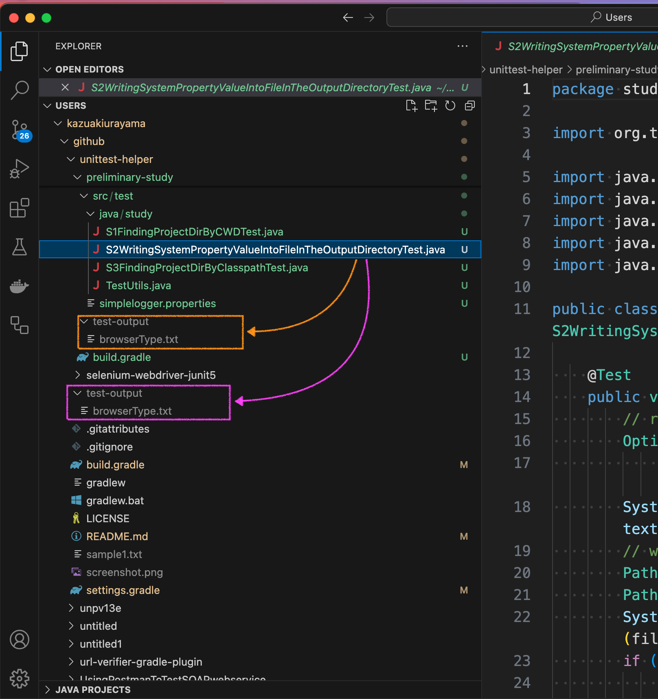

== Problems to solve

Let me explain a problem with a sample code.

I cloned the link:https://github.com/kazurayam/unittest-helper[unittest-helper] project onto my Mac machine.

Please note that this project is a link:https://docs.gradle.org/current/userguide/intro_multi_project_builds.html[Gradle Multi-Project], where the root directory `unittest-helper` contains a few sub-directories `lib`, `app` and `preliminary-study`. Each of these 3 directories contain `build.gradle` file. Gradle "Multi-Project" is just a usual style of project structure nowadays. It is nothing exceptional.

Please find link:https://github.com/kazurayam/unittest-helper/preliminary-study/src/test/java/study/S2WritingSystemPropertyValueIntoFileInTheOutputDirectoryTest.java[]:
[source,java]
----
include::../preliminary-study/src/test/java/study/S2WritingSystemPropertyValueIntoFileInTheOutputDirectoryTest.java[]
----

1. This code is a unit-test class in Java.
2. This test reads a Java System Property named `browserType` specified in the commandline option
3. This test creates a directory named `test-output`. The `test-output` directory will be located under the so-called Current Working Directory, which is identified by the System Property `user.dir`.
4. This test writes the value of System Property `browserType` into a file named `browserType.txt` which is located in the `test-output` directory.

You can find how the task `testS2` is defined in the link:https://github.com/kazurayam/unittest-helper/preliminary-study/build.gradle[]

[code,groovy]
----
tasks.register("testS2", Test) {
    useTestNG()                                  // (1)
    include "**/S2*"                             // (2)
    systemProperties System.properties           // (3)
    testLogging { showStandardStreams = true }   // (4)
    outputs.upToDateWhen { false }               // (5)
}
----

1) I declared that I want to use NestNG to run my test cases in the `testS2` task.
2) I specifically chose a class of which className starts with `S2`.
3) I passed all entries of `System.properties` into the `testS2` task
4) I specified to show all of messages from the test classes to stdout to be printed in the console
5) I specified Gradle to run the `testS2` task even if there is no change in the input.

I opened the Terminal app, and ran the following commands.

=== Case1: with the subproject's directory as Current Working Directory

[source,commandline]
----
$ cd ~/github/unittest-helper
$ cd preliminary-study
$ pwd
/Users/kazurayam/github/unittest-helper/preliminary-study
$ gradle testS2 -DbrowserType=Chrome

> Task :preliminary-study:testS2

Gradle suite > Gradle test > study.S2WritingSystemPropertyValueIntoFileInTheOutputDirectoryTest > testIt STANDARD_OUT
    System.property("browserType")=Chrome
    file path=~/github/unittest-helper/preliminary-study/test-output/browserType.txt
    file content=Chrome

BUILD SUCCESSFUL in 2s
2 actionable tasks: 1 executed, 1 up-to-date
----

Please note that the output directory `test-output` was located in the **subproject's directory** `unittest-helper/preliminary-study/`.

=== Case2: with the root project's directory as Current Working Directory

Gradle allows us another way of invoking the same task `testS2`, as follows:

[source,commandline]
----
$ pwd
/Users/kazuakiurayama/github/unittest-helper
:~/github/unittest-helper (issue36 *)
$ gradle :preliminary-study:testS2 -DbrowserType=FireFox

> Task :preliminary-study:testS2

Gradle suite > Gradle test > study.S2WritingSystemPropertyValueIntoFileInTheOutputDirectoryTest > testIt STANDARD_OUT
    System.property("browserType")=FireFox
    file path=~/github/unittest-helper/test-output/browserType.txt
    file content=FireFox

BUILD SUCCESSFUL in 3s
2 actionable tasks: 1 executed, 1 up-to-date
----

Please note that the output directory `test-output` was located in the **root project's directory** `unittest-helper/`.

=== Problem: Current Working Directory is not necessarily equal to the subproject's directory

I want my test class `study.S2WritingSystemPropertyValueIntoFileInTheOutputDireoctyTest` to create the directory `test-output` always under the subproject's directory. In the Case1, I got `unittest-helper/preliminary-study/test-output`, with which I am OK. However, in the Case2, I got `unittest-helper/test-output`. I am not happy with the result.

The source code of the test class `study.S2WritingSystemPropertyValueIntoFileInTheOutputDirectoryTest` was unchanged. But the result changed because I ran the test in the commandline a bit differently. In the Case1, I changed to the directory `unittest-helper/preliminary-study`, and in the Case2, I changed to the directory `unittest-helper`. And the important factor was that the `testS2` task had a line:

[code,groovy]
----
tasks.register("testS2", Test) {
    ...
    systemPropert System.properties
    ...
}
----

By this single line, Gradle captured all the values of System.properties at the timing when I invoked `gradle` command and the values were imported into the runtime environment where the test class `S2WrintingSystemPropertyValueIntoFileInTheOutputDirecvtoryTest` ran. In the Case1, the System Property `user.dir` had the value of `.../unittest-helpers/preliminary-study; and in the Case2, the `user.dir` had the value of `.../unittest-helper`. Therefore the directory `test-output` was located at the different layer of project structure.

=== What I want

I want the `test-output` directory to be always under the subproject's directory regardless at which directory the System property `user.dir` is set at runtime. *I should NOT rely on the `user.dir` to find out where the subproject directory is.*

=== But how?

There is a narrow path for every test classes to find out where the project's directory is without referring to the System property `user.dir`. I will show you a sample code how to.

Please find link:https://github.com/kazurayam/unittest-helper/preliminary-study/src/test/java/study/S3FindingProjectDirByClasspathTest.java[]:
[source,java]
----
include::../preliminary-study/src/test/java/study/S3FindingProjectDirByClasspathTest.java[]
----

You can run this test by `testS3` task defined in the `unittest-helper/preliminary-study/build.gradle`.

I ran it, as follows:

[code,commandline]
----
$ pwd
/Users/kazuakiurayama/github/unittest-helper/preliminary-study

$ gradle testS3

> Task :preliminary-study:testS3

Gradle suite > Gradle test > study.S3FindingProjectDirByClasspathTest > getLocationWhereThisClassIsFound STANDARD_OUT
    codeSource url=file:/Users/kazuakiurayama/github/unittest-helper/preliminary-study/build/classes/java/test/
    project directory=file:/Users/kazuakiurayama/github/unittest-helper/preliminary-study/

BUILD SUCCESSFUL in 2s
2 actionable tasks: 1 executed, 1 up-to-date
----

And also I ran the same task at a different directory

[code,commandline]
----
$ pwd
/Users/kazuakiurayama/github/unittest-helper

$ gradle :preliminary-study:testS3

> Task :preliminary-study:testS3

Gradle suite > Gradle test > study.S3FindingProjectDirByClasspathTest > getLocationWhereThisClassIsFound STANDARD_OUT
    codeSource url=file:/Users/kazuakiurayama/github/unittest-helper/preliminary-study/build/classes/java/test/
    project directory=file:/Users/kazuakiurayama/github/unittest-helper/preliminary-study/

BUILD SUCCESSFUL in 2s
2 actionable tasks: 1 executed, 1 up-to-date
----

Please note that in both trial, the test class printed the path string as the project directory:

[code,commandline]
----
    project directory=file:/Users/kazuakiurayama/github/unittest-helper/preliminary-study/
----

This is what I want to achieve. The test class `S3FindingProjectDirByClasspathTest` proved that it can find where the subproject's directory is without refering to the System property `user.dir`. Please read the source of `getLocationWhereThisClassIsFound()` method to find out the coding technique.

=== Difficulties to overcome

Read the source of `getLocationWhereThisClassIsFound` method of link:https://github.com/kazurayam/unittest-helper/preliminary-study/src/test/java/study/S3FindingProjectDirByClasspathTest.java[S3FindingProjectDirByClasspathTest]. You would notice a technical issue to overcome. The method has a fragment:

[code, java]
----
        String codeSourcePathElementsUnderProjectDirectory = "build/classes/java/test/";
        String projectDir =
                url.toString().replace(codeSourcePathElementsUnderProjectDirectory,"");

----

Here you find a string literal `build/classes/java/test/` which is a valid path elements under the project directory only in a Gradle Java project. Different string literals would be required for other Languages (Groovy, Kotlin), for other Build Tools (Gradle, Maven, Ant), for other IDEs (IDEA, Eclipse, NetBeans, etc). This possible variation makes thinks difficult to manage.

